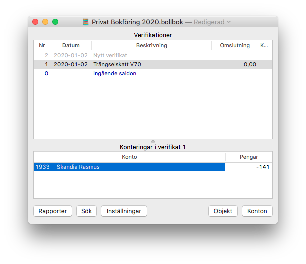
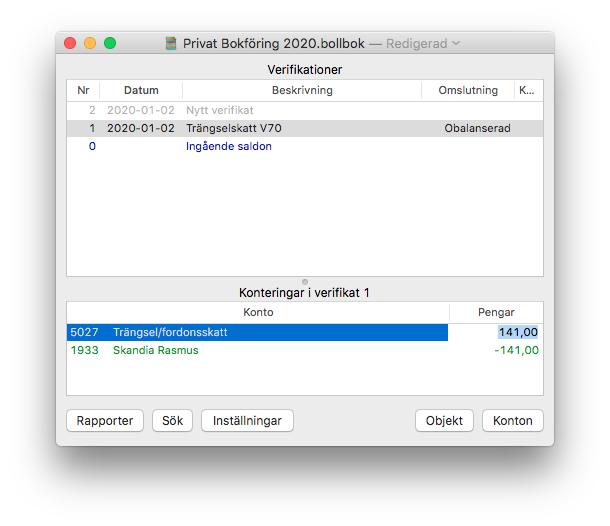
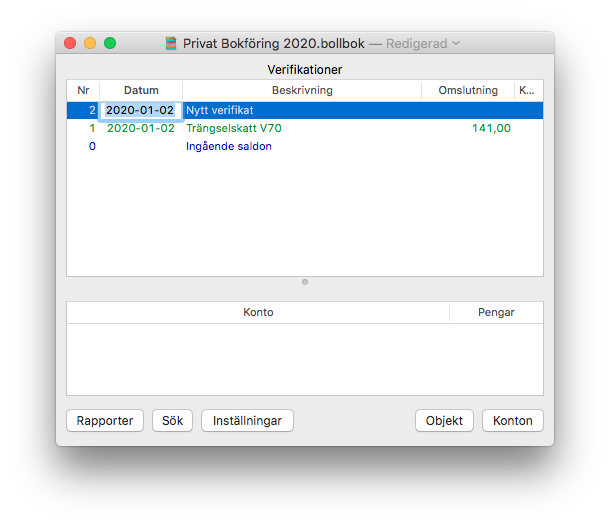

Nytt verifikat
==============

1. Tryck "Nytt verifikat"-raden `v#1`, Datum-fältet blir markerat och editerbart

2. Skriv datum och tryck Enter, Beskrivning-fältet blir markerat och editerbart

3. Skriv Beskrivning och tryck Enter. Nytt verifikat `v#2` dyker upp och konto-fältet där nere blir editerbart för `v#1`.

4. Skriv konto och tryck Enter. Pengar blir markerat och editerbart.
   

5. Skriv pengar och tryck Enter. Ny kontorad dyker upp ovanför med konto markerat och editerbart.

6. Skriv konto och tryck Enter. Pengar fylls i med förslag på balanserande belopp, blir markerat och editerbart.
   

7. Bekräfta förslag med enter. Ny kontorad dyker up ovanför med tomt konto.

8. Enter på tom rad bekräftar verifikatet. Datum på `v#2` blir markerat och editerbart.
   
